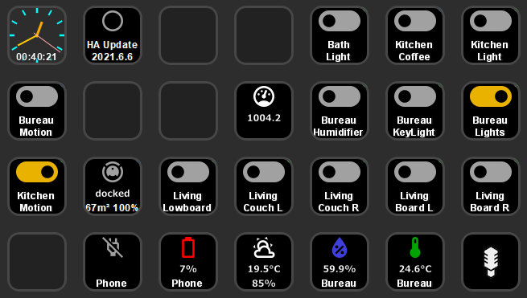
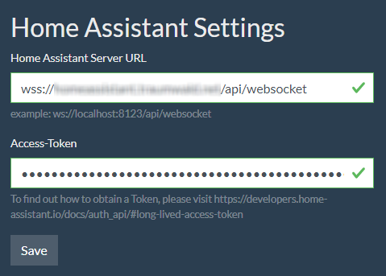
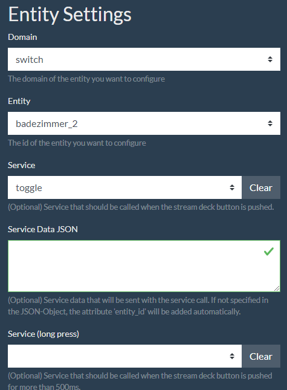

# streamdeck-homeassistant
The aim of this project is to allow owners of an elgato StreamDeck to control their entities or display sensor data via
their StreamDeck. As the code is kept very generic, nearly every sensor should work out of the box as well as every
service that does not need any more information but the entity id.



## Features
### Generic functions for any Home Assistant entity
* Display state and additional attributes via customizable templates
* Call any available service when a StreamDeck button is pressed

### Entities with background-icons
* Switches
* Lights (same icon as switches)
* Input Boolean (same icon as switches)
* Binary Sensors (like switches, but without "moving" circle)
  * Plugs
* Temperature
* Humidity
* Pressure
* Power
* Battery-Level
* Weather

# Installation
## Prequisites
* Installed Stream-Deck application
* Connected Stream-Deck

## Download & Installation
* Download latest plugin release https://github.com/cgiesche/streamdeck-homeassistant/releases
* Open downloaded .sdplugin file. It will be automatically installed into your Stream-Deck application

# Configuration
There are two sections on the plugin's cofiguration panel:
 * Home Assistant Settings  
   Contains global settings for your Home Assistant installation. Once saved, the settings are used for all stream deck Buttons.
 * Entity Settings
   Contains settings for an individual button.

## Home Assistant Settings
 * Server URL: `ws://your-homeassistant-ip-or-hostname:your-homeassistant-port/api/websocket`, for example (local network) `ws://192.126.0.5:8123/api/websocket` or (public, with ssl enabled on default port 443) `wss://my-secure-homeassistant.com/api/websocket`.
 * Access Token: An long-lived access-token obtained from your Home Assistant.  
   _Long-lived access tokens can be created using the "Long-Lived Access Tokens" section at the bottom of a user's Home Assistant profile page._ (Quote from https://developers.home-assistant.io/docs/auth_api/#long-lived-access-token)
   
After you saved your Home Assistant Settings, the plugin will automatically try to connect to your Home Assistant installation. If the connection was sucessful, the Entity Settings section should allow you to see and configure your entities.



## Entity Settings
### Basic configuration
 * Domain: Home Assistant entities are grouped by domains. Select the domain (for example "switch") of an entity, you want to configure.
 * Entity: This is the actual entity you are going to configure (for example "Kitchen Light")
 * Service: The service that will be called every time you press the StreamDeck button.
 * Service (long press): The service that will be called every time you press and hold the StreamDeck button for more than 300ms.
 * Service Data JSON: JSON formatted data that is sent with your service call when you press a button.
   Example:
   ```
   {
     "brightness": 120,
     "rgb_color": [255, 0, 0]
   }
   ```
   Please note: If not specified in the JSON, the attribute `entity_id` is added automatically containing the selected entity's id. 

### Advanced configuration
 * Custom Title: Enable to override the main Title of this button. **You have to clear the main Title field on top to make this work!**
   * Title Template: A [nunjucks template](https://mozilla.github.io/nunjucks/templating.html) that will be used as the button's title. You can use any of the variables (depending on the selected entity) that are shown below the text-field. For example `{{temperature}}°C` or `{{friendly_name}}` or (this won't fit the button, but you get the idea) `The pressure is {{pressure}} and the wind speed is {{wind_speed}}.`  
     * The variable `{{state}}` always contains the "main state" of an entity (for example "on" and "off" for buttons or "12.4" for temperature sensors)
     * The variable `{{unit_of_measurement}}` often contains the ... unit of measurement ... of a sensor's state (for example "°C" for a temperature sensor)

 * Custom Labels: Every button can display 3 lines of information, additional to the main title. You can customize them as you like.
   * Button line X: Supports exactly the same [nunjucks template](https://mozilla.github.io/nunjucks/templating.html) syntax as the main title (see above.)
  
After you hit the save button, the button should immediately show the new configuration.
  


# Happy? Consider to donating me a coffee :)
[](https://www.paypal.com/donate?hosted_button_id=3UKRJEJVWV9H4)

